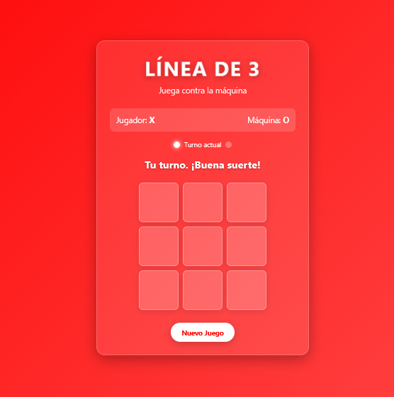

# 🔴 Línea de 3

**Línea de 3** es un juego estilo *Tic-Tac-Toe contra la máquina* desarrollado con **HTML, CSS y JavaScript puro**.  
El objetivo es alinear tres fichas (X o O) en cualquier dirección antes que la máquina, con animaciones y un diseño atractivo en tonos rojos.

## 🚀 Demo

## 📸 Captura de Pantalla

## 🎮 Características principales

- ⭐ Fondo degradado rojo con animaciones suaves.  
- 🔴 Celdas animadas al hacer clic.  
- 🕹️ Jugá contra la máquina con estrategia básica de bloqueo y ataque.  
- ⏱️ Indicador de turno en tiempo real.  
- 🎯 Animación para la línea ganadora.  
- 📱 Compatible con **dispositivos móviles y escritorio**.  
- 🔄 Botón para **reiniciar el juego** al instante.

## 📂 Estructura del proyecto
### LineaDe3/
### │── index.html
### │── css/
### ├── └── style.css 
### │── js/
### ├── └── game.js
### ├── preview.png 
### └── README.md  

## 🛠️ Tecnologías utilizadas

- **HTML5** → Estructura y celdas del juego.  
- **CSS3** → Gradientes, sombras, animaciones y estilos rojos.  
- **JavaScript** → Lógica del juego, IA básica y detección de movimientos (mouse y touch).  

## 📝 Licencia
Este proyecto está bajo la **MIT License**.  
Libre para usar, modificar y compartir.  

## ⭐ ¿Te gustó el proyecto?
¡Dejá una ⭐ en GitHub y compartilo!  
Combina **diseño atractivo y lógica desafiante** en un clásico renovado.  

# ¡Gracias por jugar **Línea de 3**! 🔴🎮